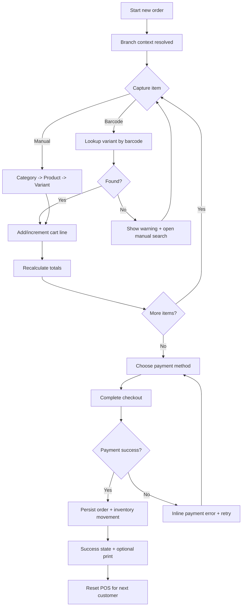

# POS UX/UI Blueprint for Convenience Store Checkout

## 1. Design Goals

This blueprint targets high-pressure cashier environments (Mini Stop / Circle K style) with strict speed and error prevention.

Primary goals:
- Complete normal checkout in 3-4 taps after item capture.
- Keep barcode scanning as the fastest path (no modal interruptions).
- Reduce cashier cognitive load with fixed zones and predictable actions.
- Guarantee branch-safe behavior (cashier can only sell on assigned branch scope).

## 2. Persona and Context

### Primary User
Cashier operating during peak traffic (queue pressure, frequent interruptions, repetitive operations).

### Constraints
- Touch device usage with fast repeated taps.
- Mixed item capture methods: barcode scan, manual search, quick pick catalog.
- Immediate feedback required (audio, visual, and inline status).
- Frequent edge cases: barcode not found, low stock, duplicate scans, customer changes payment method.

## 3. Information Architecture (Main POS Screen)

The main POS screen is split into 4 stable zones.

### Zone A: Scan & Session Bar (Top)
Purpose:
- Keep scanner input always available.
- Show current operating context.

Content:
- Always-focused barcode input.
- Quick search input (SKU/name fallback).
- Current store and branch badge.
- Cashier name and shift timer.
- Connectivity status (Online/Sync delayed).

### Zone B: Cart Workspace (Left, dominant)
Purpose:
- Show temporary cart and allow quick quantity edits.

Content:
- Line items with:
  - Variant display name (product_name + variant_name)
  - SKU/barcode secondary line
  - Unit price
  - Quantity controls (+/-)
  - Discount per line
  - Line total
  - Stock badge (Enough / Low / Out)
- Sticky cart summary:
  - Subtotal
  - Order discount
  - Payable total

### Zone C: Catalog / Quick Pick (Right upper)
Purpose:
- Manual product capture when barcode is unavailable.

Content:
- Category chips (top level categories).
- Product grid cards filtered by selected category.
- Variant chips for selected product (size/color/flavor).
- Quick pick presets (best sellers and recent picks).

### Zone D: Payment & Actions (Right lower)
Purpose:
- Finish order with minimal taps and clear hierarchy.

Content:
- Large payment method buttons:
  - Cash
  - Card
  - Bank transfer
  - QR
- Primary action: Complete checkout.
- Secondary actions:
  - Hold order
  - Cancel order
  - Call manager

## 4. Layout Specs (Implementation-ready)

Desktop landscape recommendation:
- Zone A: 10-12% height
- Main body: 88-90% height
  - Left (Zone B): 64-68% width
  - Right (Zone C + D): 32-36% width

Right column split:
- Zone C: 55-60% height
- Zone D: 40-45% height

Touch targets:
- Primary buttons: minimum 56x56 px
- Quantity +/- controls: minimum 44x44 px
- Spacing between interactive controls: at least 8 px

Typography:
- Total payable: 32-40 px, semibold/bold
- Line item name: 16-18 px
- Secondary metadata: 12-14 px

## 5. Visual Design System

### Light Mode (High Contrast)
- Background: #F5F7FA
- Surface: #FFFFFF
- Primary action: #0052CC
- Success: #0F9D58
- Warning: #F9A825
- Error: #D93025
- Main text: #111827

### Dark Mode
- Background: #0F1115
- Surface: #1A1F29
- Primary action: #4C8DFF
- Success: #36C275
- Warning: #F5B942
- Error: #FF6B6B
- Main text: #F3F4F6

Accessibility:
- Contrast must meet WCAG AA minimum.
- Color cannot be the only state indicator (pair with icon/label).

## 6. Data Mapping from Current Schema

Use current entities directly for POS rendering:

### Product/Variant Display
Data source:
- products
- product_variants

Render rules:
- Primary title: product_name + variant_name
- Secondary text: SKU and barcode
- Unit label from units.unit_name
- Selling price from product_variants.selling_price

### Inventory Status
Data source:
- inventories

Compute available quantity:
- available = quantity_on_hand - reserved_qty

Stock badge logic:
- Out: available <= 0
- Low: available > 0 and available <= reorder_level
- Enough: available > reorder_level

### Goods Receipts Context (Optional helper)
Data source:
- goods_receipts
- goods_receipt_items

Optional tooltip:
- Last restock reference and date for the variant.

## 7. Interaction Patterns

### 7.1 Barcode Scan Success
Behavior:
- Add variant instantly to cart.
- If variant exists in cart, increment quantity.
- Keep focus in barcode input.

Feedback:
- Soft success beep.
- Flash highlight on affected line for 600-800 ms.
- Toast (non-blocking) only when needed.

### 7.2 Barcode Not Found
Behavior:
- Do not block scanning flow with modal.
- Show inline warning near scan zone.
- Auto-open manual search suggestions using scanned code.

Feedback copy:
- "Barcode not mapped. Try SKU/name search."

### 7.3 Out of Stock
Behavior:
- Block adding if available <= 0.
- If low stock, allow add with warning.

Feedback:
- Red badge for out-of-stock.
- Warning toast for low stock.

### 7.4 Variant Selection in Manual Mode
Behavior:
- Tap sequence:
  - Category -> Product -> Variant
- On variant tap, add immediately to cart (no extra confirmation).

### 7.5 Quantity Editing
Behavior:
- Plus/minus one tap.
- Long press optional acceleration for bulk quantity.
- Manual numeric input optional fallback.

### 7.6 Checkout
Behavior:
- Tap payment method.
- Tap complete checkout.
- Show success state then reset to next customer.

Guardrails:
- Prevent double submit while payment request is in-flight.

## 8. Happy Path (3-4 Tap Target)

Typical happy path:
1. Scan items (0 taps if scanner keyboard wedge, or 1 interaction to focus initially).
2. Tap payment method.
3. Tap Complete checkout.
4. Optional tap Print receipt.

For exact cash shortcut:
1. Scan items
2. Tap Cash
3. Tap Complete

## 9. Workflow Diagram

## 10. Pain Points to Avoid (Retail Reality)

- Losing barcode input focus after popup/dialog.
- Overusing modal dialogs for recoverable errors.
- Tiny controls causing mistaps.
- Ambiguous branch context (cashier unsure current branch).
- Slow cart redraw after each scan.
- No visible loading/progress during payment request.
- Duplicate order creation due to repeated tapping.
- Hidden or hard-to-reach cancel/void actions.
- Allowing unrestricted price edits without audit trail.
- Error messages that are technical and non-operational.

## 11. Validation Checklist Before Go-live

Functional:
- Barcode input auto-focus restored after every action.
- Add same variant twice increments quantity, not duplicate noisy lines.
- Stock warning and stock block rules are correct per branch inventory.
- Payment buttons work with keyboard/touch equally.
- Branch-locked cashier cannot submit wrong branch orders.

Performance:
- Cart update response < 100 ms after scan (UI side).
- Product lookup should feel instant (debounce + cache on manual search).

Operational:
- Works in dark store lighting with high contrast.
- Readable from standing distance.
- Recoverable offline/slow network handling with clear status.

## 12. Suggested React Component Breakdown

- PosShellLayout
- PosSessionBar
- BarcodeCaptureInput
- CartPanel
- CartLineItem
- CartSummaryFooter
- QuickPickPanel
- CategoryChips
- ProductCardGrid
- VariantChipList
- PaymentActionPanel
- CheckoutSuccessOverlay
- PosErrorInlineBanner

State slices:
- posScope (storeId, branchId, cashier)
- cart (lines, totals, discounts)
- catalog (category/product/variant selections)
- payment (method, state, error)
- ui (focus lock, overlays, loading flags)

## 13. Current Project Integration Notes

This blueprint aligns with the existing project direction where:
- POS endpoints are separated under /api/pos namespace.
- Branch/store scope is propagated from frontend state and validated on backend.
- Sales order draft and confirm flow already exists and can be mapped to checkout states.

Next implementation step:
- Build a dedicated POS page route using the 4-zone layout and reuse existing APIs/components for barcode and variant search.
